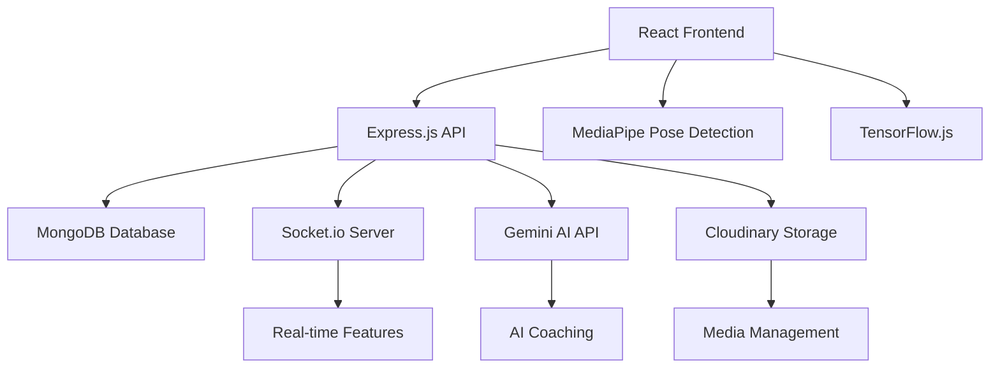

#  SportsHub - AI-Powered Sports Community Platform

<div align="center">


**Empowering Athletes with Digital Identity and AI Coaching**

[](https://sportshub-murex.vercel.app)
[](https://github.com/Siddh-2006/BrightWebXWebWonders/blob/main/LICENSE)
[](#)

</div>

---

## 🌟 Overview

**SportsHub** is a revolutionary sports management platform that bridges the gap between athletes, clubs, and AI-powered coaching. Built with the **MERN stack**, it offers a comprehensive ecosystem for sports enthusiasts to connect, compete, and excel through cutting-edge technology.

### 🎯 Mission
To democratize sports coaching and create a global community where every athlete can access world-class training, connect with clubs, and achieve their sporting dreams through AI-powered insights.

---

## ✨ Key Features

### 🤖 **AI-Powered Coaching System**
- **AI Guru Chat**: Personalized sports coaching with Gemini AI
- **Posture Analysis**: Real-time technique correction using MediaPipe Pose Detection
- **Custom Training Plans**: AI-generated workout routines tailored to individual goals
- **Performance Analytics**: Advanced metrics and progress tracking

### 🏟️ **Club Management & Networking**
- **Club Discovery**: Search and explore sports clubs worldwide
- **Challenge System**: Inter-club competitions and match scheduling
- **Live Match Updates**: Real-time score tracking and commentary
- **Club Profiles**: Comprehensive club information and statistics

### 👥 **Community Features**
- **Player Profiles**: Digital identity for athletes
- **Social Feed**: Share highlights, vlogs, and achievements
- **Live Chat**: Real-time communication during matches
- **Notifications**: Smart reminders and updates

### 🧠 **Interactive Learning**
- **Sports Quizzes**: Dynamic quizzes across multiple sports
- **Educational Content**: Tips, techniques, and strategies
- **Progress Tracking**: Monitor learning and skill development

### 📱 **Modern User Experience**
- **Responsive Design**: Seamless experience across all devices
- **Dark/Light Mode**: Customizable interface themes
- **Real-time Updates**: Live data synchronization
- **Intuitive Navigation**: User-friendly interface design

---

## 🚀 Technology Stack

### **Frontend**
- **Framework**: React.js 19.1.0 with Vite
- **Styling**: Tailwind CSS 4.1.11
- **Animations**: Framer Motion 11.18.2
- **Icons**: Lucide React 0.525.0
- **Charts**: Recharts 3.1.0
- **AI Integration**: TensorFlow.js, MediaPipe Pose Detection

### **Backend**
- **Runtime**: Node.js with Express.js 5.1.0
- **Database**: MongoDB with Mongoose 8.16.1
- **Authentication**: JWT with bcrypt encryption
- **File Upload**: Multer with Cloudinary integration
- **Real-time**: Socket.io 4.8.1
- **AI Services**: Google Gemini API

### **Deployment & DevOps**
- **Frontend**: Vercel ([Live Demo](https://sportshub-murex.vercel.app))
- **Backend**: Render
- **Database**: MongoDB Atlas
- **Media Storage**: Cloudinary
- **Version Control**: Git

---

## 📊 System Architecture



---

## 🎮 Core Features Deep Dive

### 🤖 AI Guru System
The heart of SportsHub's innovation lies in its AI-powered coaching system:

#### **Intelligent Chat Coach**
- Multi-sport expertise covering Football, Basketball, Cricket, Tennis, and more
- Personalized advice based on user profile (age, height, weight, sport)
- Real-time responses using Google Gemini AI
- Multi-language support (English, Hindi)

#### **Advanced Posture Analysis**
- **Technology**: MediaPipe Pose Detection + TensorFlow.js
- **Capabilities**: 
  - Real-time pose landmark detection
  - Sport-specific technique analysis
  - Detailed feedback with improvement suggestions
  - Performance scoring and metrics
- **Supported Media**: Images and videos up to 100MB

#### **Custom Training Plans**
- AI-generated workout routines
- Difficulty levels: Beginner, Intermediate, Advanced
- Sport-specific focus areas
- Progress tracking and adaptation

### 🏟️ Club Ecosystem
A comprehensive platform for sports clubs and organizations:

#### **Club Management**
- Club registration and approval system
- Profile customization with logos and descriptions
- Player roster management
- Match history tracking

#### **Challenge System**
- Inter-club challenge creation
- Match scheduling and coordination
- Live score updates by club admins
- Result tracking and statistics

#### **Live Features**
- Real-time match commentary
- Live score updates
- Chat during matches
- Automated match status updates via cron jobs

### 📱 User Experience Features

#### **Smart Notifications**
- Match reminders with customizable timing
- Challenge notifications
- Live match alerts
- Achievement celebrations

#### **Interactive Quizzes**
- Multi-sport knowledge testing
- Difficulty-based scoring
- Leaderboards and achievements
- Educational content integration

#### **Social Features**
- User profiles with sports statistics
- Content sharing (vlogs, highlights, posts)
- Community interactions
- Follow and connect with other athletes

---

## 🛠️ Installation & Setup

### **Prerequisites**
- Node.js (v18 or higher)
- MongoDB (local or Atlas)
- Git

### **Environment Variables**

#### **Frontend (.env)**
```env
VITE_BACKEND_URL=http://localhost:3000
VITE_GEMINI_API_KEY=your_gemini_api_key
```

#### **Backend (.env)**
```env
PORT=3000
MONGODB_URI=your_mongodb_connection_string
JWT_SECRET=your_jwt_secret
CLOUDINARY_CLOUD_NAME=your_cloudinary_name
CLOUDINARY_API_KEY=your_cloudinary_key
CLOUDINARY_API_SECRET=your_cloudinary_secret
GEMINI_API_KEY=your_gemini_api_key
```

### **Installation Steps**

1. **Clone the Repository**
   ```bash
   git clone https://github.com/Siddh-2006/BrightWebXWebWonders.git.git
   cd sportshub
   ```

2. **Backend Setup**
   ```bash
   cd SportsHub/server
   npm install
   npm start
   ```

3. **Frontend Setup**
   ```bash
   cd SportsHub/frontend
   npm install
   npm run dev
   ```

4. **Access the Application**
   - Frontend: http://localhost:5173
   - Backend: http://localhost:3000

---

## 🧪 Testing Credentials

### **Admin Access**
- **Email**: i24ai029@aid.svnit.ac.in
- **Password**: 12345

### **Club Admin Accounts**
1. **Neon Blaze Club**
   - **Email**: neha.patel@sportsclub.in
   - **Password**: password

2. **Royal Edge Cricket Club**
   - **Email**: imran.sheikh@collegesports.edu
   - **Password**: password

### **Testing Guidelines**
- Create your own account for full experience
- Access `/admin` route for club approval management
- Club admins can update live scores for their matches
- Challenge other clubs to schedule matches
- Use AI Guru for personalized coaching experience

---

## 📁 Project Structure

```
SportsHub/
├── frontend/                 # React.js Frontend
│   ├── src/
│   │   ├── components/      # Reusable UI components
│   │   ├── pages/          # Route components
│   │   ├── services/       # API service functions
│   │   ├── context/        # React context providers
│   │   ├── hooks/          # Custom React hooks
│   │   └── utils/          # Utility functions
│   ├── public/             # Static assets
│   └── package.json        # Frontend dependencies
├── server/                  # Node.js Backend
│   ├── controllers/        # Route controllers
│   ├── models/            # MongoDB schemas
│   ├── routes/            # API routes
│   ├── middlewares/       # Custom middleware
│   ├── config/            # Configuration files
│   ├── utils/             # Utility functions
│   ├── cron/              # Scheduled tasks
│   ├── socket/            # Socket.io handlers
│   └── package.json       # Backend dependencies
└── README.md              # Project documentation
```

---

## 🔧 API Documentation

### **Authentication Endpoints**
- `POST /users/register` - User registration
- `POST /users/login` - User login
- `POST /users/logout` - User logout

### **Club Management**
- `GET /clubs` - Get all clubs
- `POST /clubs/register` - Register new club
- `GET /club/:name` - Get club details
- `PUT /club-profile/:id` - Update club profile

### **AI Features**
- `POST /api/ai-guru-chat` - AI coaching chat
- `POST /api/ai-system/analyze-posture` - Posture analysis
- `POST /api/training-plans/generate` - Generate training plan
- `POST /api/custom-training-plans/create` - Create custom plan

### **Match & Challenge System**
- `POST /challenges/create` - Create club challenge
- `GET /challenges/my-club` - Get club challenges
- `POST /match/create` - Create match
- `PUT /match/:id/score` - Update live score

### **Quiz System**
- `GET /api/quiz/questions` - Get quiz questions
- `POST /api/quiz/submit` - Submit quiz answers
- `GET /api/quiz/leaderboard` - Get leaderboard

---

## 🎨 Design System

### **Color Palette**
- **Primary Orange**: #F97316 (Orange-500)
- **Primary Red**: #DC2626 (Red-600)
- **Primary Blue**: #3B82F6 (Blue-500)
- **Success Green**: #10B981 (Emerald-500)
- **Warning Yellow**: #F59E0B (Amber-500)

### **Typography**
- **Headings**: Bold, gradient text effects
- **Body**: Clean, readable fonts
- **Interactive**: Hover effects and transitions

### **Components**
- **Cards**: Glassmorphism design with backdrop blur
- **Buttons**: Gradient backgrounds with hover animations
- **Modals**: Centered overlays with smooth transitions
- **Forms**: Clean inputs with focus states

---

## 🚀 Deployment Guide

### **Frontend Deployment (Vercel)**
1. Connect GitHub repository to Vercel
2. Set environment variables in Vercel dashboard
3. Deploy with automatic builds on push

### **Backend Deployment (Render)**
1. Create new web service on Render
2. Connect GitHub repository
3. Set environment variables
4. Configure build and start commands

### **Database Setup (MongoDB Atlas)**
1. Create MongoDB Atlas cluster
2. Configure network access
3. Create database user
4. Get connection string

---

## 🤝 Contributing

We welcome contributions from the community! Here's how you can help:

### **Getting Started**
1. Fork the repository
2. Create a feature branch
3. Make your changes
4. Submit a pull request

### **Contribution Guidelines**
- Follow existing code style
- Add tests for new features
- Update documentation
- Ensure all tests pass

### **Areas for Contribution**
- New sports integration
- AI model improvements
- UI/UX enhancements
- Performance optimizations
- Bug fixes and testing

---

## 📈 Roadmap

### **Phase 1: Core Features** ✅
- [x] User authentication and profiles
- [x] Club management system
- [x] AI coaching integration
- [x] Basic match functionality

### **Phase 2: Advanced AI** ✅
- [x] Posture analysis with MediaPipe
- [x] Custom training plans
- [x] Performance analytics
- [x] Multi-sport support

### **Phase 3: Community Features** ✅
- [x] Live chat and notifications
- [x] Quiz system
- [x] Social features
- [x] Mobile responsiveness

### **Phase 4: Future Enhancements** 🚧
- [ ] Mobile app development
- [ ] Advanced analytics dashboard
- [ ] Tournament management
- [ ] Marketplace for sports equipment
- [ ] Video streaming integration
- [ ] AR/VR training modules

---

##  Achievements & Recognition

- **🎯 AI Integration**: Successfully integrated multiple AI technologies
- **📱 User Experience**: Responsive design across all devices
- **⚡ Performance**: Optimized for fast loading and smooth interactions
- **🔒 Security**: Secure authentication and data protection
- **🌐 Scalability**: Built for growth and expansion

---

## 📞 Support & Contact

### **Development Team**
- **Team**: Bright Web Team
- **Project**: SportsHub Platform
- **Version**: 1.0.0

### **Getting Help**
- 📧 **Email**: support@sportshub.com
- 🐛 **Bug Reports**: Create an issue on GitHub
- 💡 **Feature Requests**: Submit via GitHub discussions
- 📖 **Documentation**: Check our comprehensive guides

### **Community**
- 💬 **Discord**: Join our developer community
- 🐦 **Twitter**: Follow for updates
- 📺 **YouTube**: Video tutorials and demos

---

## 📄 License

This project is licensed under the **MIT License** - see the [LICENSE](LICENSE) file for details.

### **MIT License Summary**
- ✅ Commercial use
- ✅ Modification
- ✅ Distribution
- ✅ Private use
- ❌ Liability
- ❌ Warranty

---

## 🙏 Acknowledgments

### **Technologies & Libraries**
- **React Team** for the amazing frontend framework
- **Google** for Gemini AI and MediaPipe technologies
- **MongoDB** for the robust database solution
- **Vercel & Render** for seamless deployment platforms

### **Open Source Community**
- All contributors and maintainers
- Beta testers and early adopters
- Sports enthusiasts who provided feedback

### **Special Thanks**
- Sports coaches who validated our AI coaching features
- Club administrators who tested the management system
- Athletes who provided real-world usage feedback

---

<div align="center">

**Made with ❤️ by the Bright Web Team**

[](https://github.com/Siddh-2006/BrightWebXWebWonders.git)
[](https://twitter.com/sportshub)

**[🌐 Visit SportsHub](https://sportshub-murex.vercel.app) | [📖 Documentation](./docs/) | [🚀 Get Started](#installation--setup)**

</div>
