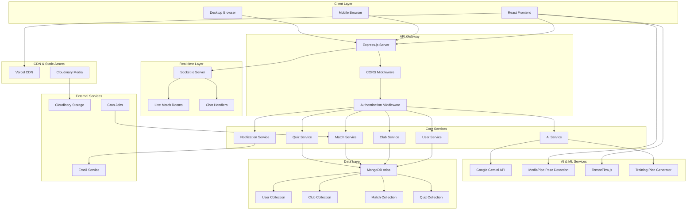
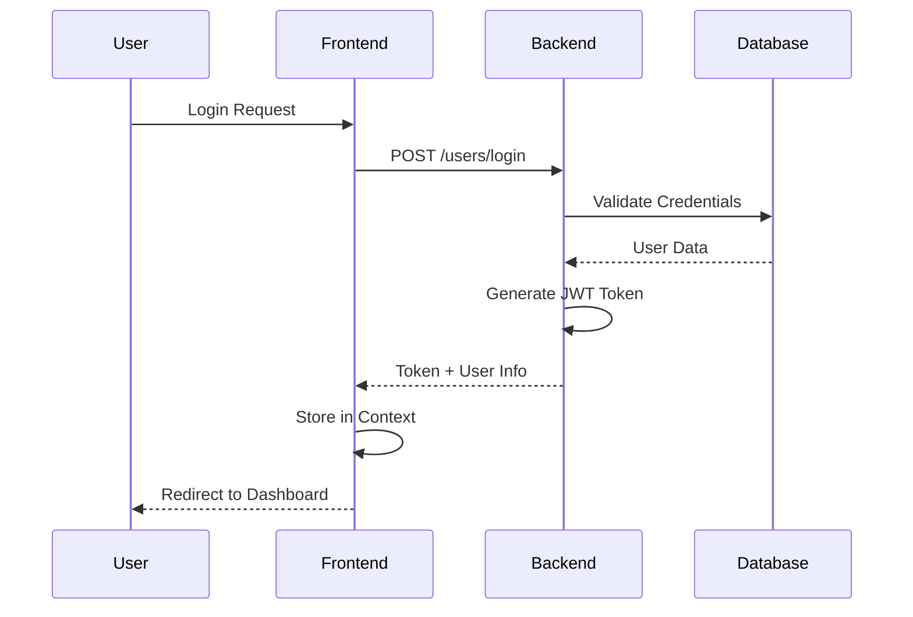
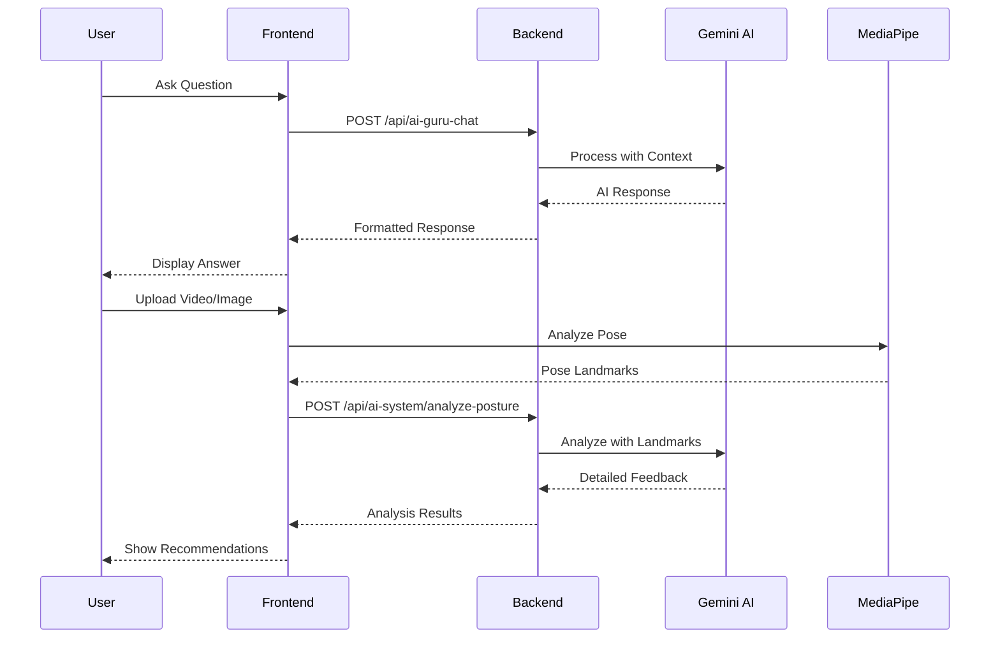
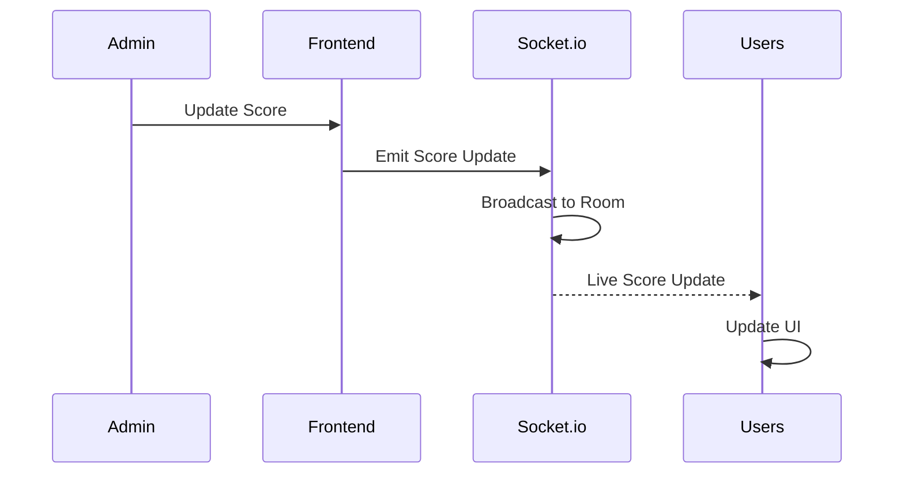

# 🏗️ SportsHub Architecture Documentation

## 📋 Table of Contents
- [System Overview](#system-overview)
- [Architecture Diagram](#architecture-diagram)
- [Component Breakdown](#component-breakdown)
- [Data Flow](#data-flow)
- [Technology Stack](#technology-stack)
- [Security Architecture](#security-architecture)
- [Performance Considerations](#performance-considerations)

---

## 🌐 System Overview

SportsHub is built on a modern, scalable architecture that combines the power of AI, real-time communication, and cloud technologies to deliver a comprehensive sports platform.

### **Core Principles**
- **Microservices-Ready**: Modular design for easy scaling
- **AI-First**: Integrated AI capabilities throughout the platform
- **Real-time**: Live updates and instant communication
- **Mobile-First**: Responsive design for all devices
- **Cloud-Native**: Built for cloud deployment and scaling

---

## 🎯 Architecture Diagram



---

## 🧩 Component Breakdown

### **Frontend Architecture**

#### **React Component Hierarchy**
```
App.jsx
├── Navbar.jsx
├── Router
│   ├── Home.jsx
│   ├── AIGuru.jsx
│   │   ├── Chat Interface
│   │   ├── Posture Analysis
│   │   └── Training Plans
│   ├── Club.jsx
│   │   ├── Club Cards
│   │   ├── Challenge Modal
│   │   └── Add Club Modal
│   ├── Profile.jsx
│   ├── Live.jsx
│   └── Quiz.jsx
├── Footer.jsx
└── Global Components
    ├── NotificationToast.jsx
    ├── ReminderToast.jsx
    └── ScrollToTop.jsx
```

#### **State Management**
- **Context API**: User authentication, navigation state
- **Local State**: Component-specific data
- **Real-time State**: Socket.io for live updates

#### **Routing Structure**
```
/                    # Home page
/ai-guru            # AI coaching interface
/clubs              # Club discovery
/club/:name         # Individual club details
/profile            # User profile
/live               # Live matches
/quiz               # Interactive quizzes
/admin              # Admin panel
/login              # Authentication
/logout             # Logout handler
```

### **Backend Architecture**

#### **Express.js Server Structure**
```
app.js                 # Main application entry
├── config/           # Configuration files
│   ├── db.js         # Database connection
│   ├── cloudinary.js # Media storage config
│   └── keys.js       # Environment variables
├── controllers/      # Business logic
│   ├── userController.js
│   ├── clubController.js
│   ├── matchController.js
│   ├── aiController.js
│   └── quizController.js
├── models/          # MongoDB schemas
│   ├── user-model.js
│   ├── club-model.js
│   ├── match-model.js
│   └── quiz-model.js
├── routes/          # API endpoints
│   ├── usersRouter.js
│   ├── clubsRouter.js
│   ├── matchRouter.js
│   ├── aiGuruChatRouter.js
│   └── quizRoutes.js
├── middlewares/     # Custom middleware
│   ├── authMiddleware.js
│   ├── clubMiddleware.js
│   └── commonMiddleware.js
├── socket/          # Real-time handlers
│   └── liveMatchRoomHandler.js
├── cron/           # Scheduled tasks
│   ├── matchStatusUpdater.js
│   └── quizCronJobs.js
└── utils/          # Utility functions
    ├── generateToken.js
    ├── uploadToCloudinary.js
    └── geminiApiManager.js
```

---

## 🔄 Data Flow

### **User Authentication Flow**


### **AI Coaching Flow**


### **Real-time Match Updates**


---

## 💾 Database Schema

### **User Collection**
```javascript
{
  _id: ObjectId,
  name: String,
  email: String,
  password: String (hashed),
  userType: String, // 'player', 'admin'
  profile: {
    age: Number,
    height: Number,
    weight: Number,
    sports: [String],
    achievements: [String]
  },
  clubMemberships: [ObjectId],
  createdAt: Date,
  updatedAt: Date
}
```

### **Club Collection**
```javascript
{
  _id: ObjectId,
  name: String,
  description: String,
  logo: String, // Cloudinary URL
  owner: ObjectId, // User ID
  players: [ObjectId],
  approved: Boolean,
  location: String,
  sports: [String],
  matchHistory: [ObjectId],
  achievements: [String],
  socialLinks: {
    website: String,
    instagram: String,
    twitter: String
  },
  createdAt: Date,
  updatedAt: Date
}
```

### **Match Collection**
```javascript
{
  _id: ObjectId,
  clubA: ObjectId,
  clubB: ObjectId,
  sport: String,
  status: String, // 'scheduled', 'live', 'ended'
  score: {
    clubA: Number,
    clubB: Number
  },
  scheduledFor: Date,
  venue: String,
  liveUpdates: [{
    timestamp: Date,
    event: String,
    description: String
  }],
  createdAt: Date,
  updatedAt: Date
}
```

---

## 🔒 Security Architecture

### **Authentication & Authorization**
- **JWT Tokens**: Secure user sessions
- **Password Hashing**: bcrypt with salt rounds
- **Role-based Access**: Admin, Club Owner, Player roles
- **Session Management**: Secure cookie handling

### **Data Protection**
- **Input Validation**: Sanitization of all user inputs
- **CORS Configuration**: Restricted cross-origin requests
- **Rate Limiting**: API endpoint protection
- **File Upload Security**: Type and size validation

### **API Security**
```javascript
// CORS Configuration
app.use(cors({
  origin: [
    "http://localhost:5173",
    "https://sportshub3.vercel.app"
  ],
  credentials: true
}));

// Authentication Middleware
const authMiddleware = (req, res, next) => {
  const token = req.cookies.token;
  if (!token) return res.status(401).json({ error: 'Unauthorized' });
  
  try {
    const decoded = jwt.verify(token, process.env.JWT_SECRET);
    req.user = decoded;
    next();
  } catch (error) {
    res.status(401).json({ error: 'Invalid token' });
  }
};
```

---

## ⚡ Performance Considerations

### **Frontend Optimization**
- **Code Splitting**: Lazy loading of components
- **Image Optimization**: Cloudinary transformations
- **Caching**: Browser caching strategies
- **Bundle Size**: Tree shaking and minification

### **Backend Optimization**
- **Database Indexing**: Optimized queries
- **Connection Pooling**: Efficient database connections
- **Caching**: Redis for session storage (future)
- **CDN**: Static asset delivery

### **Real-time Performance**
- **Socket.io Rooms**: Efficient event broadcasting
- **Connection Management**: Automatic reconnection
- **Message Queuing**: Reliable message delivery

---

## 🚀 Scalability Strategy

### **Horizontal Scaling**
- **Microservices**: Service decomposition
- **Load Balancing**: Multiple server instances
- **Database Sharding**: Data distribution
- **CDN**: Global content delivery

### **Vertical Scaling**
- **Resource Optimization**: Memory and CPU usage
- **Database Optimization**: Query performance
- **Caching Layers**: Multiple cache levels

### **Future Enhancements**
- **Kubernetes**: Container orchestration
- **Message Queues**: RabbitMQ/Redis
- **API Gateway**: Kong/AWS API Gateway
- **Monitoring**: Prometheus/Grafana

---

## 📊 Monitoring & Analytics

### **Application Monitoring**
- **Error Tracking**: Sentry integration (planned)
- **Performance Monitoring**: New Relic (planned)
- **Uptime Monitoring**: Pingdom (planned)

### **User Analytics**
- **Usage Tracking**: Google Analytics
- **Feature Analytics**: Custom event tracking
- **Performance Metrics**: Core Web Vitals

### **System Health**
- **Database Monitoring**: MongoDB Atlas metrics
- **Server Monitoring**: Render dashboard
- **CDN Monitoring**: Vercel analytics

---

This architecture documentation provides a comprehensive overview of SportsHub's technical foundation, designed for scalability, security, and optimal user experience.