# 🔄 SportsHub System Flowcharts

## 📋 Table of Contents
- [User Journey Flowcharts](#user-journey-flowcharts)
- [AI System Workflows](#ai-system-workflows)
- [Club Management Flows](#club-management-flows)
- [Real-time Features](#real-time-features)
- [Data Processing Flows](#data-processing-flows)

---

## 👤 User Journey Flowcharts

### **New User Registration & Onboarding**
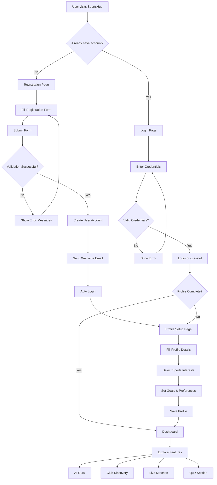

### **AI Guru User Journey**
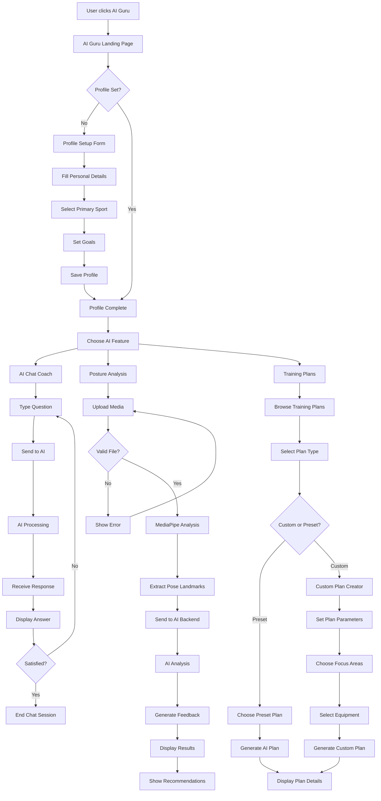

---

## 🏟️ Club Management Flows

### **Club Registration & Management**
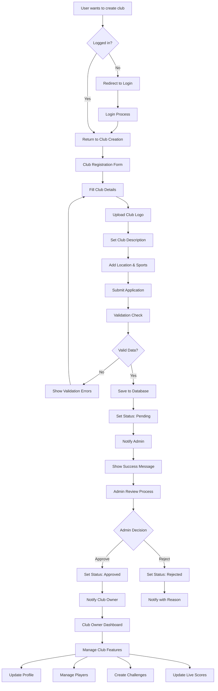

### **Club Challenge System**
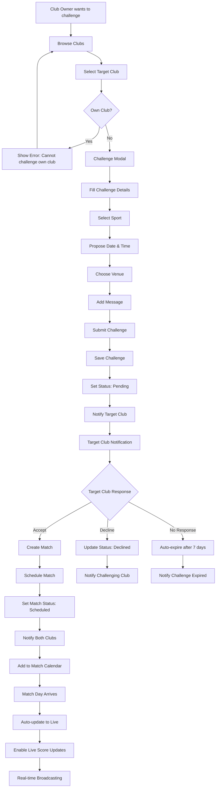

---

## 🤖 AI System Workflows

### **AI Chat Processing**
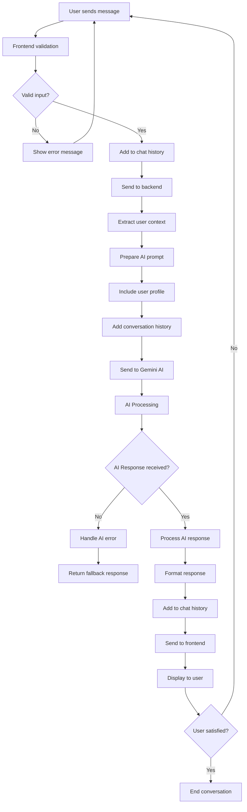

### **Posture Analysis Workflow**
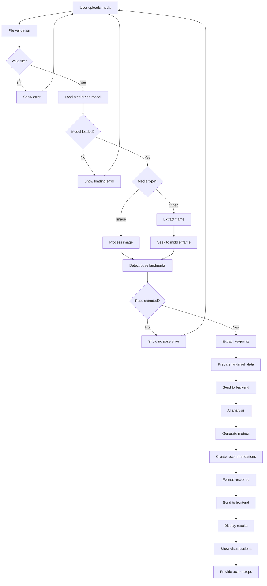

---

## 🔴 Real-time Features

### **Live Match Updates**
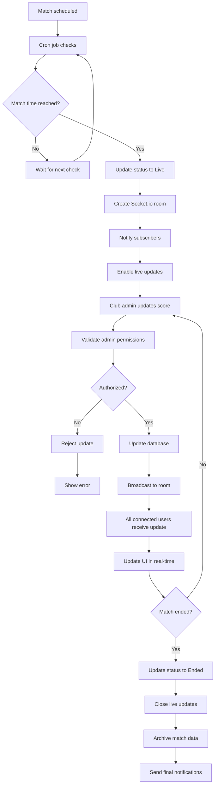

### **Notification System**
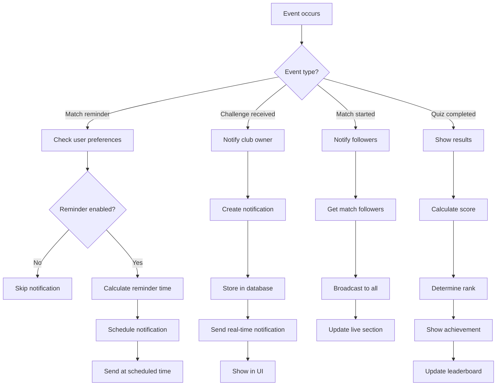

---

## 📊 Data Processing Flows

### **Quiz System Processing**
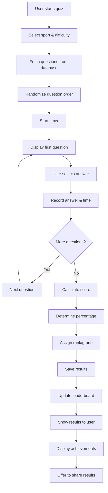

### **User Profile Analytics**
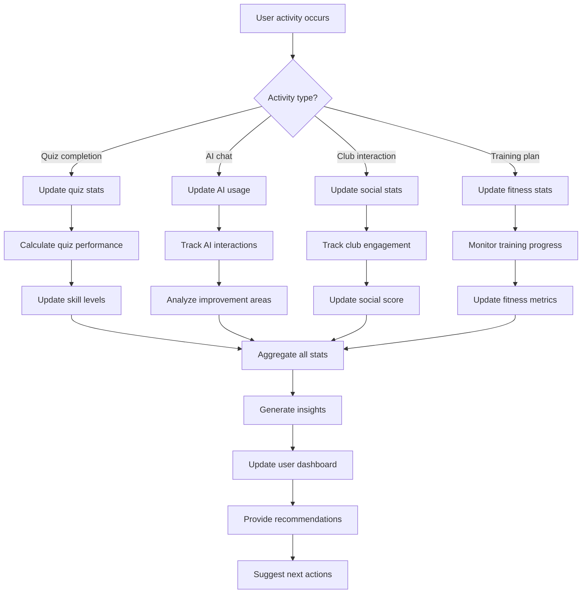

---

## 🔄 System Integration Flow

### **Complete User Session**
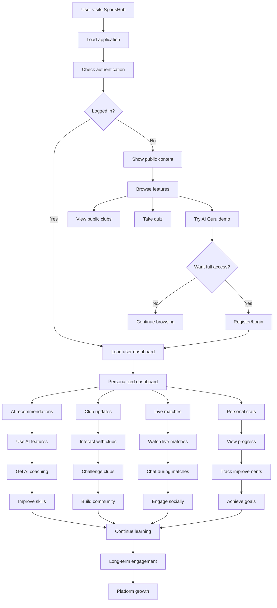

This comprehensive flowchart documentation provides visual representations of all major user journeys and system processes in SportsHub, making it easier for developers and stakeholders to understand the platform's functionality and user experience.